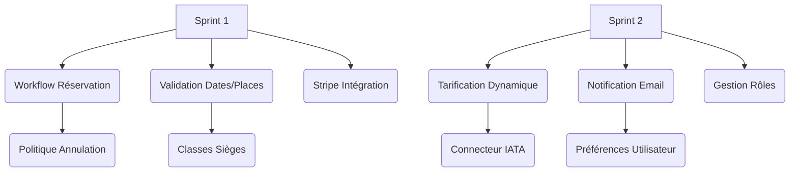
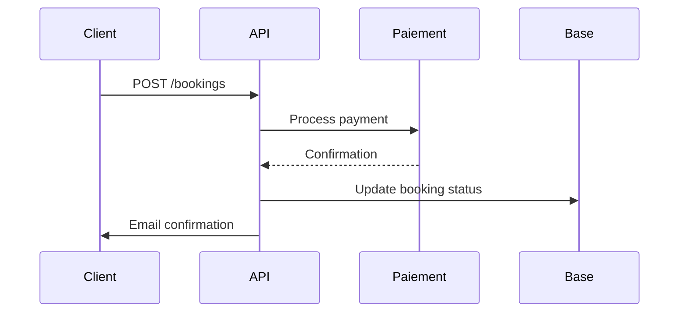
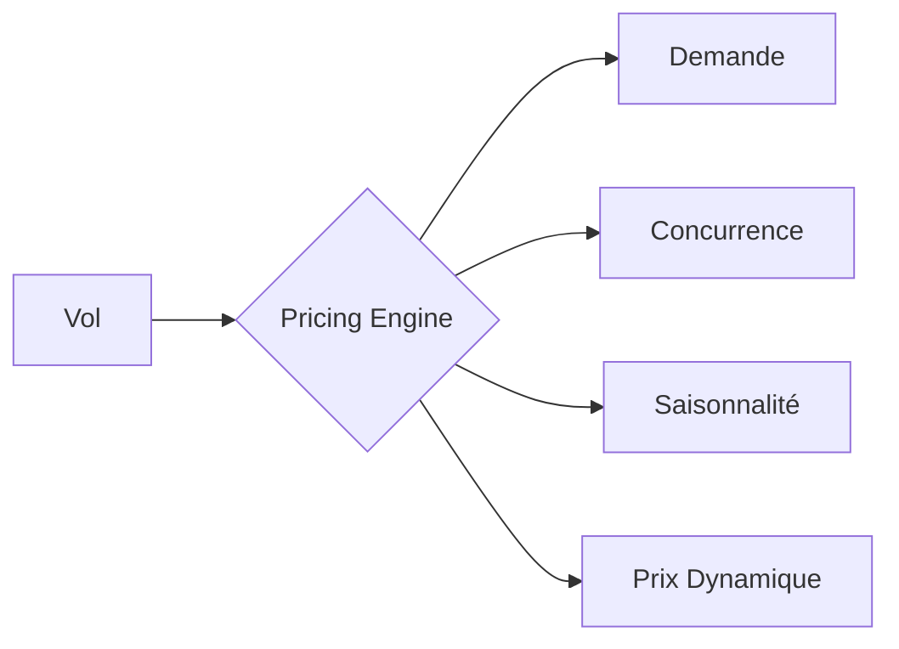

### Stratégie de priorisation pour les premiers sprints

Voici les 15 tâches critiques à placer dans les 2-3 premiers sprints, classées par ordre de priorité :



### Tickets prioritaires pour Sprint 1

1. **Workflow de réservation (FLG-57)**
    - États PENDING→CONFIRMED→CANCELLED
    - Annulation auto après 24h sans paiement
    - *Estimation: 13 SP*

2. **Validation des dates et capacité (FLG-55)**
    - Bloque création si départ ≥ arrivée
    - Vérifie sièges_disponibles ≤ capacité_totale
    - *Estimation: 5 SP*

3. **API de paiement sécurisé (FLG-65)**
    - Intégration Stripe (cartes + PayPal)
    - Endpoint POST /payments/process
    - *Estimation: 8 SP*

4. **Machine à états des réservations**
   ```java
   // Pseudocode
   stateMachine
     .withStates()
        .initial(BookingState.PENDING)
        .state(BookingState.CONFIRMED)
        .state(BookingState.CANCELLED)
     .withExternal()
        .source(PENDING).target(CONFIRMED).event(PAYMENT_RECEIVED)
        .guard(paymentValidGuard())
   ```

### Tickets prioritaires pour Sprint 2

5. **Politique d'annulation dynamique (FLG-58)**
    - Calcul: 100% si >7j, 50% si 48h-7j, 0% si <48h
    - Endpoint GET /bookings/{id}/cancel-fee
    - *Estimation: 5 SP*

6. **Tarification dynamique basique (FLG-59)**
    - Prix base +1.5%/siège réservé (48h)
    - Offre LASTMINUTE: -10% (départ <72h)
    - *Estimation: 8 SP*

7. **Notification de confirmation (FLG-61)**
    - Email avec QR code
    - Template Thymeleaf personnalisé
    - *Estimation: 3 SP*

8. **Gestion des rôles (FLG-64)**
    - ADMIN (full), AIRLINE (ses vols), USER (lecture)
    - RBAC avec Spring Security
    - *Estimation: 3 SP*

### Pourquoi cette priorisation ?

1. **Établir le cœur métier** d'abord :
    - Workflow réservation → Cycle de revenu
    - Paiement → Monétisation
    - Validation → Intégrité données

2. **Dépendances naturelles** :
    - Impossible d'avoir tarification sans workflow réservation
    - Inutile de notifier sans confirmation de paiement

3. **Valeur client immédiate** :
    - Processus achat complet en Sprint 1
    - Fonctionnalités payantes opérationnelles rapidement

### Feuille de route technique

**Sprint 1 - Fondations**:


**Sprint 2 - Optimisation**:


### Bonnes pratiques d'implémentation

1. **Feature Flags** :
   ```java
   // Activation progressive
   if (featureFlagService.isActive("DYNAMIC_PRICING")) {
       price = pricingEngine.calculate(flight);
   } else {
       price = flight.getBasePrice();
   }
   ```

2. **Monitoring initial** :
   ```bash
   # Métriques clés à suivre
   booking_workflow_duration
   payment_success_rate
   price_update_frequency
   ```

3. **Tests critiques** :
   ```gherkin
   Scenario: Annulation avec remboursement
     Given un booking confirmé créé il y a 10 jours
     When le vol est dans 8 jours
     Then le remboursement doit être de 100%
   ```

Cette approche garantit une livraison de valeur métier tangible dès les premières itérations, tout en posant les bases pour les fonctionnalités avancées.